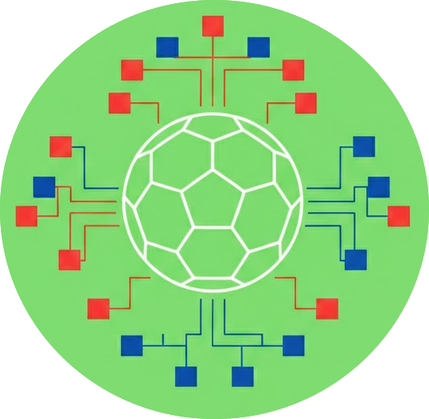
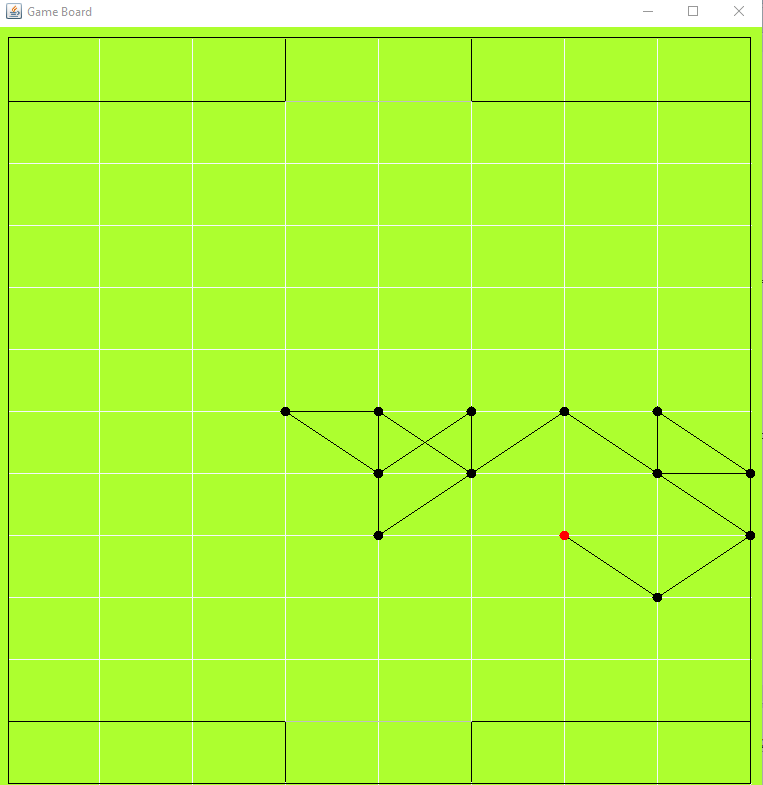

  

# PaperSoccer

**A Competitive Player vs Player and Player vs AI Soccer Game Using the Minimax Algorithm**

---

## Overview

PaperSoccer is a turn-based game where players compete to score goals by drawing lines on a grid. The game features:
- **Player vs Player** mode
- **Player vs AI** mode, powered by the **Minimax algorithm**
- **Java Swing** for the user interface

The AI opponent uses the Minimax algorithm to strategically move closer to the player's goal, maximizing its chances of scoring.

---

## Game Rules

1. Players take turns drawing lines between dots on the grid.
2. You **cannot** draw a line on an edge that has already been visited.
3. Drawing a line on a **visited point** or a **wall** grants you an extra turn.
4. The goal is to reach the opponent's goal line first.

---

## AI Implementation

The AI uses the **Minimax algorithm** to determine the best possible move in each round. The utility function prioritizes:
- Moving closer to the opponent's goal
- Blocking the player's potential winning paths
- Maximizing the AI's chances of scoring

### Key Behaviors
1. Minimax Algorithm:
    - The AI simulates future moves using a depth-limited Minimax search (limited to 30 moves to prevent infinite recursion).
    - It alternates between MAX (AI's turn) and MIN (player's turn) to find the optimal path.
2. Utility Function:
    - The utility is based on the Euclidean distance from the ball to the opponent's goal.
    - The AI aims to minimize this distance, while the player aims to maximize it.
3. Move Selection:
    - The AI evaluates all possible moves (up, down, left, right, diagonals).
    - It prioritizes moves that bring the ball closer to the goal or block the player's path.
4. Edge Cases:
    - If the ball is on the side of the board, the AI adjusts its strategy to avoid invalid moves.
    - If only one move is available, the AI takes it immediately

### Example Board

